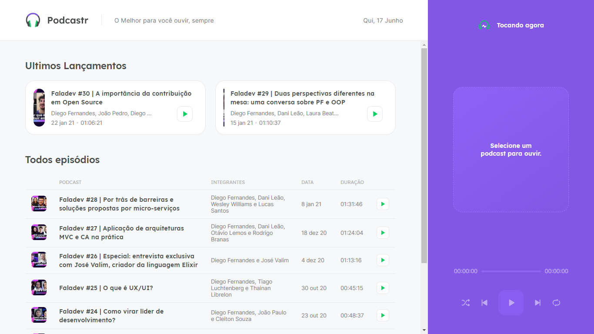
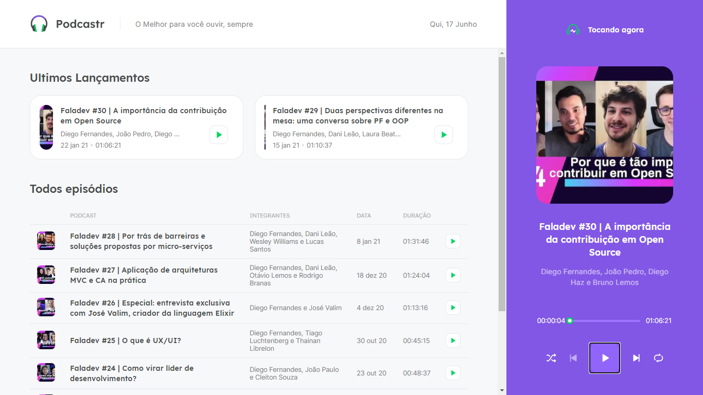
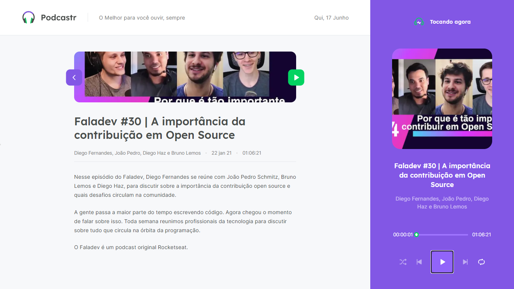

<h1 align="center">
    
</h1>

<h2 align="center"> 
  <p>
  Podcastr    
  
  </p>
  
  
  
</h2>

# 🚀Projeto 

O **Podcastr** é um aplicativo que permite listar e ouvir podcasts.

O aplicativo fornece todos os comandos comuns de um repordutor de audio.

##### Este projeto foi um resultado do NLW-05 - Next Level Week - da [Rocketseat](https://rocketseat.com.br/).

# 🖌 Layout

O layout do projeto pode ser acessado pelo [Figma](https://www.figma.com/) atravês desse [link](https://www.figma.com/file/wb4JoqqUQWruv70cAzUZG7/Podcastr-(Copy)?node-id=160%3A2761).

# 💻 Tecnologias

* **[TypeScript](https://www.typescriptlang.org/)**
* **[ReactJS](https://pt-br.reactjs.org/)**
* **[NextJS](https://nextjs.org/)**
* **[Sass](https://sass-lang.com/install)**

# 📚 Funcionalidades

* tocar podcastr.
* pausar podcastr.
* pular podcastr.
* voltar pro podcastr anterior.
* modo aleatório dos podcastr.
* descriçaõ de cada podcastr.
* mover barrinha de progreso do podcastr.

# 🔧 Instalação

### Dependencias
* [Git](https://git-scm.com/)
* [Node.js](https://nodejs.org/en/)
* [NPM](https://www.npmjs.com/get-npm) ou [Yarn](https://yarnpkg.com/) ( se voce usa npm? Exclua o arquivo yarn.lock)

```bash
# Clone este repositório.
$ git clone https://github.com/Sogeking07/Nlw-5-React.git

# Vá para a pasta Nlw-5-React.
$ cd nlw-5-React

# Instale as dependências
$ npm install / yarn

# Execute the json-server which mocks an API
$ npm run server / yarn server

# Execute the dev script
$ npm run dev / yarn dev

# O app vai está rodando na porta 3000 - acesse <http://localhost:3000>

```

# 😁 Autor


Feito com ❤️ por Kelvyn Reis 👋🏽 Entre em contato!

[](https://www.linkedin.com/in/kelvyn-dos-reis-511b201b9/)
[](mailto:kelvyn2reis@gmail.com)


# Licença

- Copyright © 2021 [Sogeking07](https://github.com/Sogeking07)
- This project is [MIT](https://github.com/Sogeking07/Nlw-5-React/blob/main/LICENSE) licensed.

